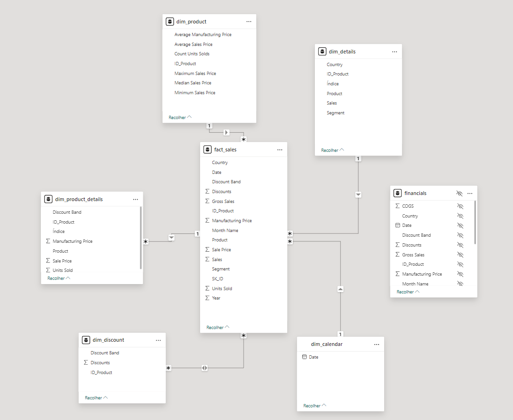

#Processo de Construção do Diagrama no Power BI

## Introdução
Este projeto documenta a construção de um modelo de dados no Power BI, focado em tabelas dimensionais e de fatos, usando DAX para criação e manipulação.

## Etapas do Processo

1. **Importação dos Dados**
   - Importação da tabela `financials` contendo colunas relevantes para análise.

2. **Criação das Tabelas Dimensionais e de Fatos**
   - Criação das tabelas `dim_product`, `dim_discount`, `dim_product_details`, `dim_details` e `fact_sales`.

3. **Criação da Tabela de Calendário**
   - Utilização do DAX para criar `dim_calendar`.
   - **DAX utilizado**:
     ```dax
     dim_calendar = CALENDAR(MIN(financials[Date]), MAX(financials[Date]))
     ```
   - A função `CALENDAR` gera uma tabela de datas contínuas no intervalo especificado, facilitando análises temporais.

4. **Relacionamentos entre Tabelas**
   - Configuração de relacionamentos lógicos entre as tabelas, conforme mostrado no diagrama.



## Conclusão
Este projeto exemplifica o uso de DAX no Power BI para criar e manipular tabelas, garantindo a integridade dos dados e facilitando análises complexas.


